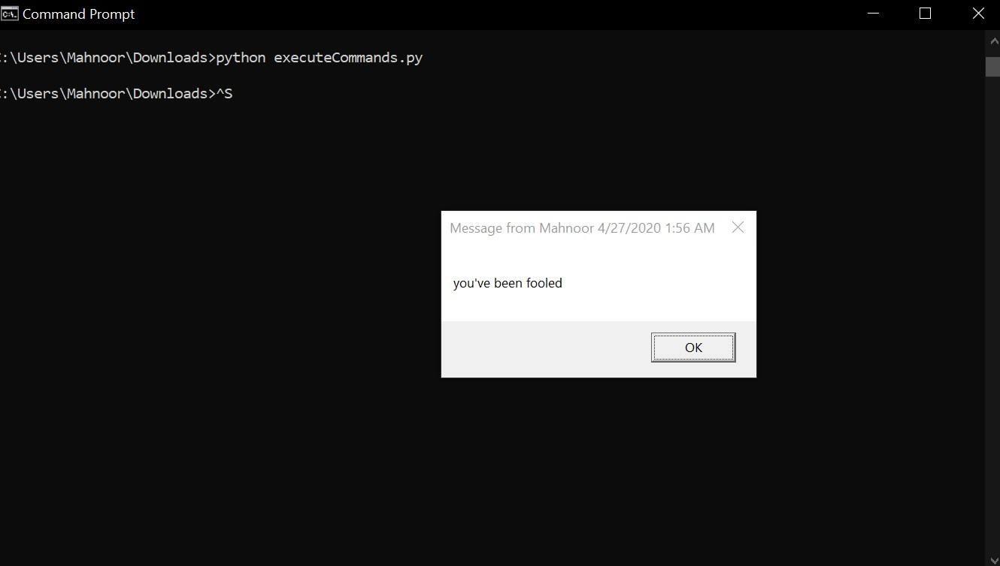
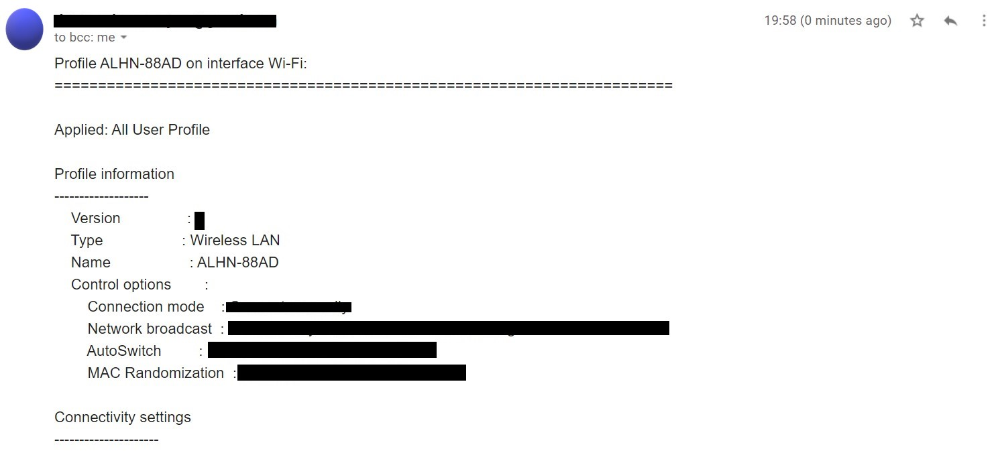
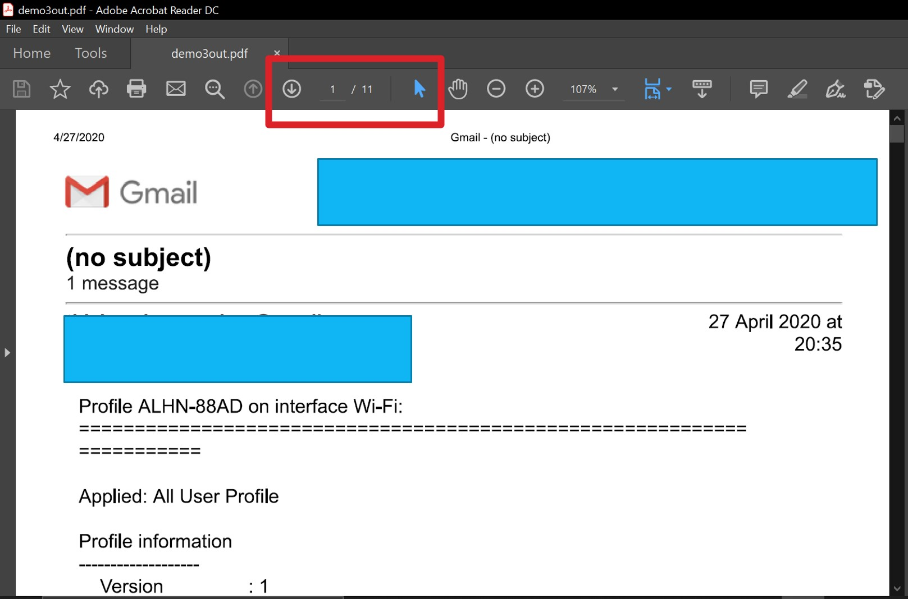
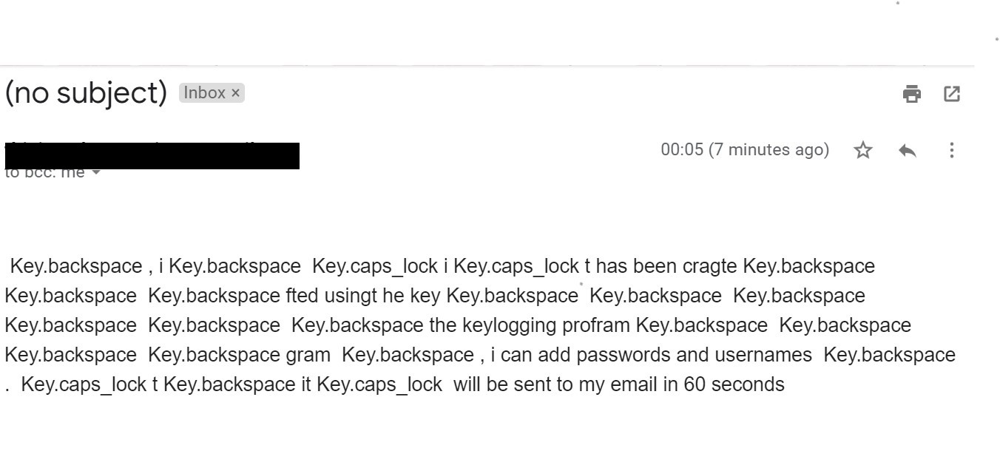
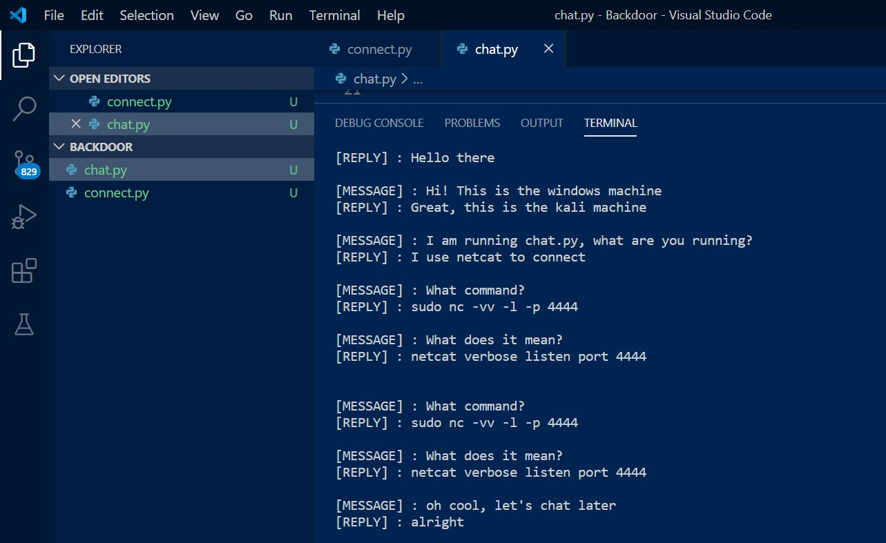
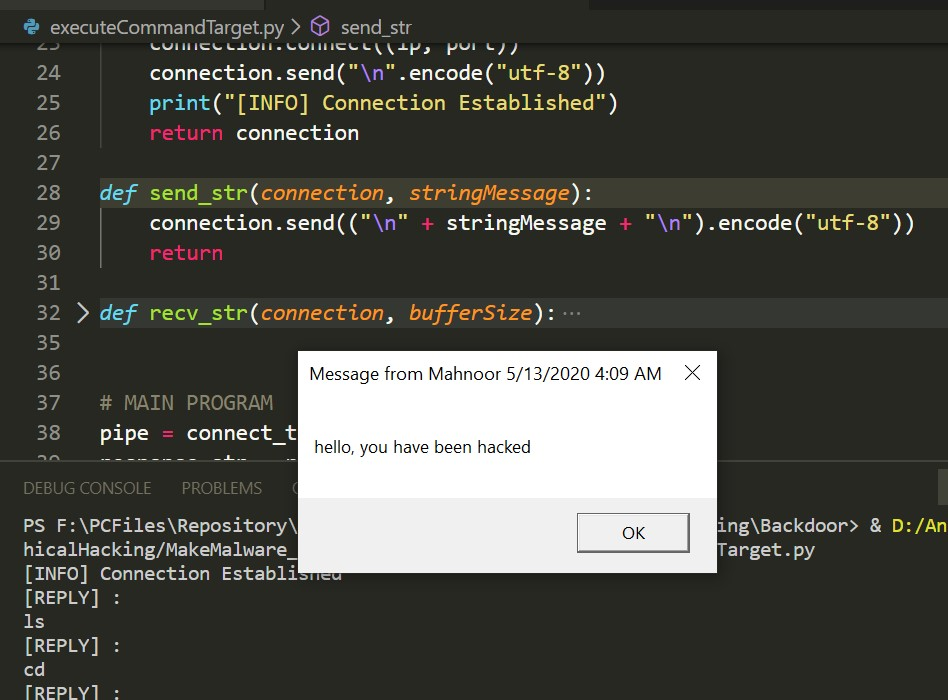
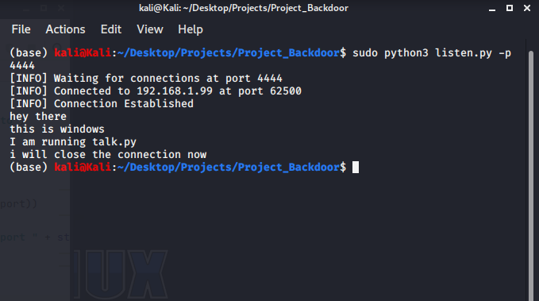
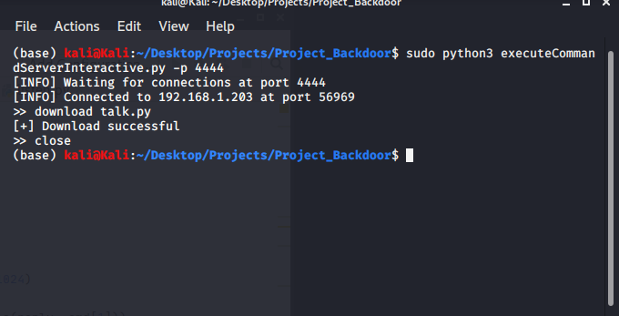

# Making Malware 
This repo consists of backdoors, keyloggers, and other fun malware codes. The demonstrations are for educational purposes only.
## Getting Started
Download the repository and run the codes using;
> Python == 3+
>
## Details
| File | Information |
|-------|------------|
| Project_Backdoor  | Backdoor Implementation | 
| Project_Keylogger  | Keylogger  | 
| demo1_executeCommands.py  | execute commands  | 
| demo1out.jpg  | demo 1 output | 
| demo2_getReportByEmail.py  | get reports by email | 
| demo2out.jpg  | demo 2 output  | 
| demo3_stealWLAN.py  | steal WLAN passwords | 
| demo3out.jpg  | demo 3 output  | 
| demo4_downloadFilesOnTarget.py  | download files on target pc | 
| demo5_downloadAndRunFilesOnTarget.py  | download and run files on target pc | 
| demo6_DownloadExecuteReport.py  | execute and report via email | 
| demo7_DownloadExecuteReportDelete.py  | execute, report and delete  | 
| pb_out1.jpg  | backdoor output | 
| pb_out2.jpg  | backdoor output 2 | 
| pb_out_file.png  | backdoor file download  | 
| pb_out_talk.png  | backdoor talk  | 
| pk_out.jpg  | backdoor output 3 | 

## Demo 1

## Demo 2

## Demo 3

## Keylogger 

## Backdoor 

